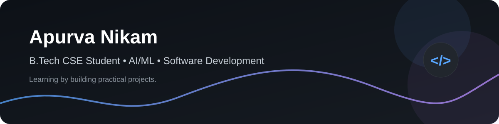

<picture>
  <source media="(prefers-color-scheme: dark)" srcset="./dark.svg">
  <source media="(prefers-color-scheme: light)" srcset="./light.svg">
  
</picture>

# Hi 👋, I'm Apurva Nikam

### B.Tech CSE Student · Building AI-Powered Software

  
  

---

## 👩‍💻 About Me

I'm a 2nd-year **B.Tech Computer Science & Engineering** student, graduating in **2029**.
I enjoy building practical software, experimenting with intelligent systems, and learning by creating projects.

---

## 🧠 Skills & Technologies

### Languages

### AI / ML

### Development

### Computer Vision

### Tools & Platforms

---

## 🚀 Featured Projects

<table>
<tr>
<td width="50%" valign="top">

### 🖐️ Fingertip Neural Interface

Control a computer using fingertip gestures with MediaPipe and OpenCV.

**Stack:** Python · OpenCV · MediaPipe

</td>
<td width="50%" valign="top">

### 👥 CrowdSense-AI

Real-time crowd detection using TensorFlow.js and machine learning.

**Stack:** TypeScript · TensorFlow.js · Machine Learning

</td>
</tr>

<tr>
<td width="50%" valign="top">

### 🖱️ Gesture Controlled Mouse

Gesture-based computer control built with Python, MediaPipe and OpenCV.

**Stack:** Python · MediaPipe · OpenCV

</td>
<td width="50%" valign="top">

### 💬 Termino

A JavaScript project from my software-development journey.

**Stack:** JavaScript

</td>
</tr>
</table>

---

## 🌱 Currently Learning

Machine Learning · Deep Learning · Data Structures & Algorithms · Java OOP · System Design

---

## 💬 Ask Me About

Building projects, coding ideas, hackathons, and my journey as a CSE student.

---

## 📫 How to Reach Me

<a href="nikamapurva25@gmail.com">Gmail</a>

---

<b>Build · Learn · Improve · Repeat 🔁</b>

